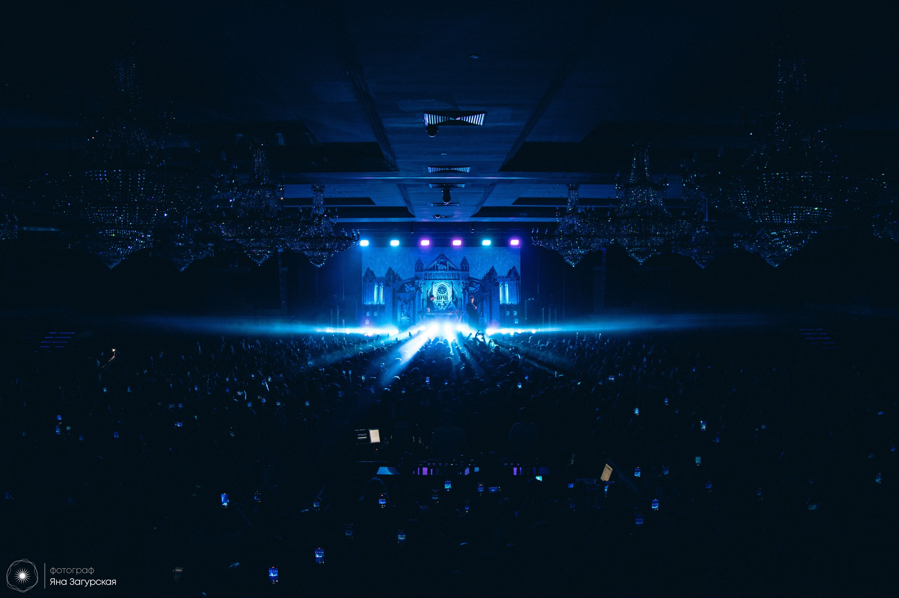
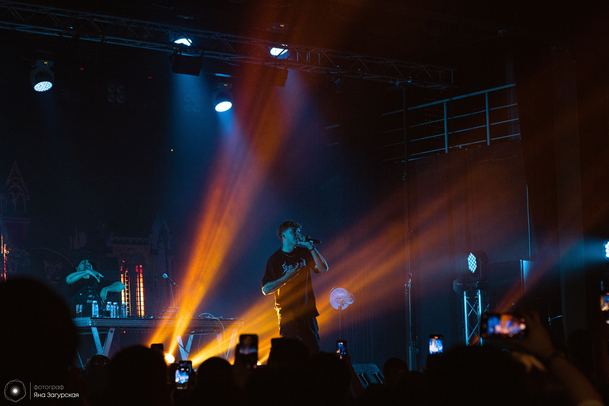
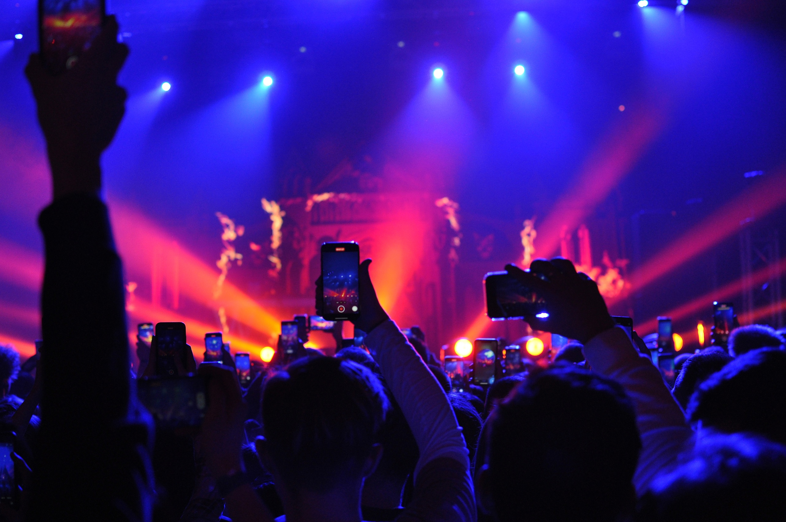

Казань вызывает у меня противоречивые чувства.
Мне там и понравилось, и не понравилось одновременно.
Хотя, может, я там был не в то время.
Но обо всё по порядку.

## Жизнь до 24.02.2023

### Markul

Уже как год я большой поклонник музыканта Markul.
Я слушал его и раньше, но не был так сильно погружен в его творчество.

Его строчки из песни X-Ray:

_"...твой секрет успеха  
Нужно, бл#ть, еб#шить, а не слушать падших  
И не слушать старших  
Если брать пример с них — всё будет также..."_

стали для меня жизненным кредо.

24.02.2023 должен был состояться концерт, последний и завершающий его Pressure Tour по России, в городе Казань.

### Билеты

На момент написание этого материала, я учусь на 2 курсе в универе и продолжаю
создавать сайты, работая удалённо в компании.

Просто так взять и уехать - не получится. Но эти дни особенные:

- 23 февраля - четверг, праздничный выходной
- 24 февраля - пятница, праздничный выходной
- 25 февраля - суббота, обычный выходной
- 26 февраля - воскресенье, обычный выходной

4 подряд идущих выходных: не идеальный ли повод поехать в мини-путешествие по Казани на несколько дней?

Идеальный. Билеты куплены.

## Назад в 2021 год

### Лето 2021

На момент, когда я первый раз поехал в другой город один, мне было 17 лет.
Из Челябинска в Екатеринбург. Город, в котором сейчас я учусь и работаю.

Моим спонсором был фриланс.
Тогда я работал над сайтом, который работает и приносит пользу до сих пор! 
Это был проект, над которым было комфортно работать:

1. приятные заказчики;
2. интересные задачи, в которые погружаться было одно удовольствие.

Что интересно, найти в 17 лет жильё на несколько дней стало проблемой.
Мне отказывали потому что я несовершеннолетний. Договор с таким человеком, как я, было не подписать.
Но ладно, это меня не особо остановило 😂

### Осень 2021

Через полгода я поехал во второй город - Казань.
Была возможность, а почему нет?

В обе поездки со мной была огромная сумка с вещами, из которых мне, в лучшем случае, пригодилось 20% вещей.
"А зачем столько брать?" - подумал я и решил, что рюкзака вполне хватит.

Меня посетила следующая мысль:

_"Интересно получается. Всё жизненно необходимое находится на мне (банковские карты, одежда, паспорт, телефон),
а что не помещается в карманах, находится в рюкзаке у меня за спиной.
И как просто путешествовать, имея удалённую работу. Взял ноутбук - и поехал.  
Да вообще время интересное: компактные банковские карты вместо огромного кошелька, тонкие ноутбуки вместо
персонального компьютера - всё помещается в портфель."_

## Жизнь 24.02.2023

И речь здесь будет не про один день из поездки.
Это 3 длинных дня, которые я находился там в период с 23 по 25 февраля.

### Дорога в Казань

В поездах, я считаю, есть своя атмосфера. Уютная.
Поезда прежде всего у меня ассоциируются с запахом огурчиков, сырокопчёной колбасы, доширака и
общительных людей (ну интересно с ними). Не скучно, в общем.

### Главная площадь

_Первый день. Тут красиво, как и полтора года назад._

### Мороз. Зима. Казань. Волейбол.

Люблю волейбол. А встретить своих в чужом городе всегда приятно.

_На фото кажется, что их 3. Но, на самом деле, их 4. И они играют в пляжный волейбол на снегу._

Центр города, -14, по ощущениям -25, ветер, 10 утра.

Очень приветливые люди. Жалею только, что с ними не удалось поиграть 😀

### Искусство. Тишина. Спокойствие. Библиотека.

_Искусство. В этом что-то есть._

_Отсюда, на втором этаже, открывается панорамный вид на город. Так и хочется прийти туда и почитать._

### Ко-о-о-о-онцерт: я за этим же приехал 😅

Мне повезло: я был почти у сцены. До неё - рукой подать.

_Фотографии с концерта._

[Источник](https://vk.com/markul_kazan2022)

Нарезка всех треков, которые исполнял Марк:

<iframe width="100%" height="315" src="https://www.youtube.com/embed/GEWpZUjIoGk" title="YouTube video player" frameborder="0" allow="accelerometer; autoplay; clipboard-write; encrypted-media; gyroscope; picture-in-picture; web-share" allowfullscreen></iframe>

Назабываемая атмосфера. Побывав там один раз, хочется ещё и ещё.
Эти эмоции. Зал. Музыкант.

Полтора часа лучшей музыки. Лучших треков. Лучшего исполнения. Проходят на одном дыхании.

Жаль что так быстро 😮‍💨

### Последний день в городе

_Крепость. Снегопад. Тоска._

## Жизнь после 24.02.2023

Кстати, домой я увёз такой плакат:

С автографом Марка. Теперь он висит на видном месте и заряжает атмосферой того дня 🌆

### К началу статьи

Всё было не так однозначно, да ведь? Да.
Было 2 момента, которые меня смущали во время и после поездки.

Гуляя в последний день в центре города, я зашёл в какой-то район.
Ощущение было такое, что этот район - неблагополучный.
Атмосфера бедности. Мусульман, которые гуляли с коляской и просили денег. Нищета.
Всегда в такие моменты хочется убежать поскорее из этого района.
Но неприятный шлейф воспоминаний остаётся.

Но это не так критично. Для меня город показался каким-то старинным.
По сути так и есть: крепость, старые здания, традиции.
Да простят меня казанцы, жить в Казани я бы не хотел. Узкие улочки, старые дома, крепости - не моё.
Вот Екатеринбург - другое дело: новостройки, широкие улицы,
велосипедисты (к слову о моей страсти к велоспорту), современные здания,
ощущение всего нового и амбиций.

## Вывод

В целом, мне всё понравилось.
Чувствую, что не зря съездил, учитывая, что потрачено на поездку, по моим меркам, было не так много.
А эмоций много.

Нужно обязательно побывать в других городах (а такие на примете есть).
А на концерт Марка в следующий раз обязательно пойду!

-----

Мне очень нравится писать текста (в последнее время хочется писать особенно много).
Мне хотелось о чем-то рассказать.
Но в первую очередь я хотел закрыть для себя тему Казани и этой поездки для самого себя.
Поэтому если кому-то было действительно интересно прочитать материал, то я втройне доволен проделанной работой 😌
