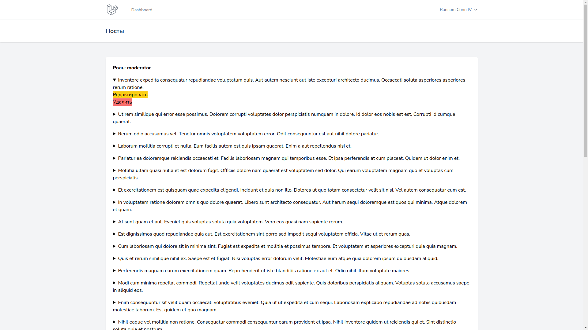
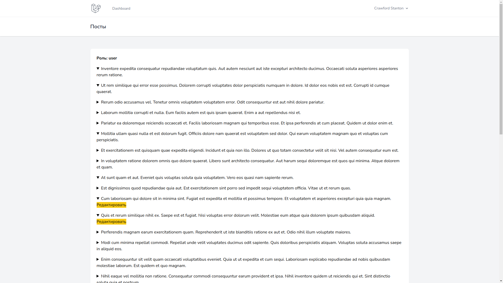

## Вступление

На практике часто стоит задача реализовать делегирование прав в проекте на Laravel, когда есть личный кабинет или панель администратора. Также есть несколько ролей; каждая роль имеет свои права и разрешения. Типичная задача ― реализовать личный кабинет с четырьмя ролями:

1. администратор,
2. менеджер,
3. сотрудник,
4. пользователь.

Здесь подразумевается, что администратор наделен всеми правами; менеджер может уже чуть меньше ― в его компетенцию входит следить за сотрудниками и данными, которые они вносят; сотрудники могут видеть и изменять только свои посты, данные, которые ввели другие сотрудники они не видят; пользователь ― только что зарегистрировавшийся человек, не наделенный никакими правами доступа к личному кабинету.

Laravel идеально подходит для создания гибких веб-приложений: панелей администратора, систем управления сайтом, личных кабинетов. Фреймворк нас никак не ограничивает ― здесь мы можем творить что угодно, а большинство необходимых инструментов идут уже “из коробки”.

## Описание задачи

Долгое время я пользовался библиотекой laravel-permissions от Spatie, не зная о том, что задачу можно решить, используя чистый Laravel. Я говорю о гейтах и политиках, которые позволяют лаконично и просто решить задачу, описанную выше.
Чтобы объяснить принцип работы гейтов и политик, давайте рассмотрим другой пример. Есть блог, в блоге ― личный кабинет, где

1. любой пользователь может создавать и изменять свои посты, но не удалять их;
2. модератор видит все посты, может изменять или удалять их;
3. администратор имеет все привилегии, кроме того назначает модераторов.

## Требования к установке

Это простой проект на Laravel 9 **с изначально установленной Breeze**, для того чтобы у нас сразу был функционал авторизации и личный кабинет. Данная статья предполагает, что у вас уже имеются начальные знания Laravel.

## Создаем простой блог с делегированием прав

Далее я выполняю команду `php artisan make:model Post -mf --policy`. Мы создадим одновременно модель, миграцию, фабрику и политику. Далее выполним команду `php artisan make:controller PostController --model=Post`, чтобы создать ресурсный контроллер. Первое, что мы делаем ― редактируем миграции:
```php
// <timestamp>_create_posts_table.php
public function up()
{
    Schema::create('posts', function (Blueprint $table) {
        $table->id();
        $table->foreignId('user_id');
        $table->string('title');
        $table->string('slug');
        $table->text('content');
        $table->timestamps();
    });
}

 // <timestamp>_create_users_table.php
public function up()
{
    Schema::create('users', function (Blueprint $table) {
        $table->id();
        $table->string('name');
        $table->string('email')->unique();
        $table->timestamp('email_verified_at')->nullable();
        $table->string('password');
        $table->string('role');
        $table->rememberToken();
        $table->timestamps();
    });
}
```
Создаем таблицу постов, которая будет содержать название поста, slug, содержание, и будет ссылаться на пользователя, который создал пост. Второе, что мы делаем, ― изменяем модель пользователя:
```php
class User extends Authenticatable
{
    use HasApiTokens, HasFactory, Notifiable;
    
    public const ADMIN = 'admin';
    public const MODERATOR = 'moderator';
    public const USER = 'user';

    protected $fillable = [
        'name',
        'email',
        'password',
    ];

    protected $hidden = [
        'password',
        'remember_token',
    ];

    protected $casts = [
        'email_verified_at' => 'datetime',
    ];
    
    public function posts()
    {
        return $this->hasMany(Post::class);
    }
    
    public function isAdmin(): bool
    {
        return $this->role === User::ADMIN;
    }
    
    public function isModerator(): bool
    {
        return $this->role === User::MODERATOR;
    }
    
    public function isUser(): bool
    {
        return $this->role === User::USER;
    }
}
```
В модели пользователя мы определяем в константу роли, которые будут в проекте, и для каждой роли создаём метод, проверяющий, есть ли данная роль у пользователя.  И в методе `posts` определяем отношение один ко многим, чтобы в дальнейшем мы могли этим методом воспользоваться. Следующее ― редактируем фабрики для создания пользователей с одной из трёх ролей и создания постов:
```php
// UserFactory.php
public function definition()
{
    return [
        'name' => $this->faker->name(),
        'email' => $this->faker->unique()->safeEmail(),
        'email_verified_at' => now(),
        'password' => '$2y$10$92IXUNpkjO0rOQ5byMi.Ye4oKoEa3Ro9llC/.og/at2.uheWG/igi', // password
        'remember_token' => Str::random(10),
        'role' => $this->faker->randomElement([User::ADMIN, User::MODERATOR, User::USER]),
    ];
}

// PostFactory.php
public function definition()
{
    $title = $this->faker->text(200);

    return [
        'title' => $title,
        'slug' => Str::slug($title),
        'content' => $this->faker->sentences(10)
    ];
}
```
И отредактируем `DatabaseSeeder`:
```php
// DatabaseSeeder.php

public function run()
{
     User::factory(10)->create()->each(function ($user) {
         $user->posts()->saveMany(Post::factory(4)->make());
     });
}
```
Пользователей и посты для простоты мы генерируем через фабрики. Таким образом у нас есть 10 пользователей с одной из трех ролей и у каждого пользователя есть еще по 4 поста. В каталоге `resources/views/posts` создадим 3 файла:

1. `index.blade.php` ― страница со всеми статьями
2. `create.blade.php` ― страница для создания поста
3. `edit.blade.php` ― страница для редактирования поста

*Примечание. В этом же каталоге можно создать 4-й файл ― `show.blade.php`, чтобы любые пользователи могли читать пост. В этом уроке делается акцент именно на политику, а показы, создание и изменения постов опускается.*

Отредактируем маршруты:
```php
<?php
// web.php

use App\Http\Controllers\PostController;
use Illuminate\Support\Facades\Route;

Route::get('/', function () {
    return view('welcome');
});

Route::middleware(['auth'])->group(function () {
    Route::get('/dashboard', function () {
        return view('dashboard');
    })->name('dashboard');
    
    Route::resource('posts', PostController::class);
});

require __DIR__.'/auth.php';
```
Далее идем в `AuthServiceProvider`:
```php
class AuthServiceProvider extends ServiceProvider
{
    protected $policies = [
         'App\Models\Post' => 'App\Policies\PostPolicy',
    ];
    
    public function boot()
    {
        $this->registerPolicies();

        Gate::before(function (User $user) {
            if ($user->isAdmin())
                return true;
        });
    }
}
```
Здесь в `protected` поле мы регистрируем нашу политику, которую отредактируем ниже, а в методе `boot` делаем проверку на то, что пользователь является администратором. Если пользователь является администратором, то ему доступны любые возможности, что бы мы не добавили в дальнейшем в политики. В конструкторе контроллера регистрируем политику, чтобы все методы были защищены ею:
```php
class PostController extends Controller
{
    public function __construct()
    {
        $this->authorizeResource(Post::class);
    }

    public function index()
    {
        $posts = Post::all();

        return view('posts.index', compact('posts'));
    }

    public function create()
    {
        return view('posts.create');
    }

    public function store(Request $request)
    {
        //...
    }

    public function edit(Post $post)
    {
        return view('posts.edit', compact('post'));
    }

    public function update(Request $request, Post $post)
    {
        //...
    }

    public function destroy(Post $post)
    {
        $post->delete();

        return to_route('posts.index');
    }
}
```
Самое интересное ― политика:
```php
class PostPolicy
{
    use HandlesAuthorization;

    public function viewAny(User $user)
    {
        return true;
    }

    public function view(User $user, Post $post)
    {
        return true;
    }

    public function create(User $user)
    {
        return true;
    }

    public function update(User $user, Post $post)
    {
        return $user->id === $post->user_id || $user->isModerator();
    }

    public function delete(User $user, Post $post)
    {
        return $user->isModerator();
    }

    public function restore(User $user, Post $post)
    {
        return false;
    }

    public function forceDelete(User $user, Post $post)
    {
        return false;
    }
}
```
В политиках могут быть какие угодно условия, что делает приложение очень гибким к настройке. Здесь мы видим, что изменять содержимое может либо хозяин поста, либо модератор, а удалять пост может только модератор. Каждый метод в политике соответствует определённому методу в ресурсном контроллере:

| Метод контроллера | Метод политики |
| ------ | --------|
| index	| viewAny |
| show | view |
| create | create |
| store | create |
| edit | update |
| update |	update |
| destroy |	delete |

В Blade шаблонах можно использовать директиву `@can`, что делать проверки:
```blade
// index.blade.php
<x-app-layout>
    <x-slot name="header">
        <h2 class="font-semibold text-xl text-gray-800 leading-tight">
            {{ __('Посты') }}
        </h2>
    </x-slot>

    <div class="py-12">
        <div class="max-w-7xl mx-auto sm:px-6 lg:px-8">
            <div class="bg-white overflow-hidden shadow-sm sm:rounded-lg">
                <div class="p-6 bg-white border-b border-gray-200">
                    <div class="mb-4 font-bold">Роль: {{ auth()->user()->role }}</div>
                    @foreach($posts as $post)
                        @can('view', $post)
                            <details class="mb-4">
                                <summary>{{ $post->title }}</summary>

                                @can('update', $post)
                                    <a class="bg-yellow-400" href="{{ route('posts.edit', $post->id) }}">Редактировать</a>
                                @endcan

                                @can('delete', $post)
                                    <form action="{{ route('posts.destroy', $post->id) }}" method="POST">
                                        @csrf
                                        @method('DELETE')
                                        <button class="bg-red-400" type="submit">Удалить</button>
                                    </form>
                                @endcan
                            </details>
                        @endcan
                    @endforeach
                </div>
            </div>
        </div>
    </div>
</x-app-layout>

// create.blade.php
<x-app-layout>
    <x-slot name="header">
        <h2 class="font-semibold text-xl text-gray-800 leading-tight">
            {{ __('Создать пост') }}
        </h2>
    </x-slot>

    <div class="py-12">
        <div class="max-w-7xl mx-auto sm:px-6 lg:px-8">
            <div class="bg-white overflow-hidden shadow-sm sm:rounded-lg">
                <div class="p-6 bg-white border-b border-gray-200">
                    Создание поста
                </div>
            </div>
        </div>
    </div>
</x-app-layout>

// edit.blade.php
<x-app-layout>
    <x-slot name="header">
        <h2 class="font-semibold text-xl text-gray-800 leading-tight">
            {{ __('Редактировать пост') }}
        </h2>
    </x-slot>

    <div class="py-12">
        <div class="max-w-7xl mx-auto sm:px-6 lg:px-8">
            <div class="bg-white overflow-hidden shadow-sm sm:rounded-lg">
                <div class="p-6 bg-white border-b border-gray-200">
                    Редактирование поста
                </div>
            </div>
        </div>
    </div>
</x-app-layout>
```
Получилось! То, что видит администратор и модератор, в данном случае не отличается:



А пользователь хоть и видит все посты, однако не может их удалять, а редактировать способен только свои посты:



## Заключение

Это часто встречающая задача на примере блога. Здесь огромный потенциал для расширения и улучшения политики. Например, мы может проверять, опубликована ли статья или находится ещё на редакции; функционал выдачи ролей; проверка, не заблокирован ли пользователь и тд. При том администратору при добавлении любого нового функционала благодаря проверке в провайдере будут доступы любые возможности!
