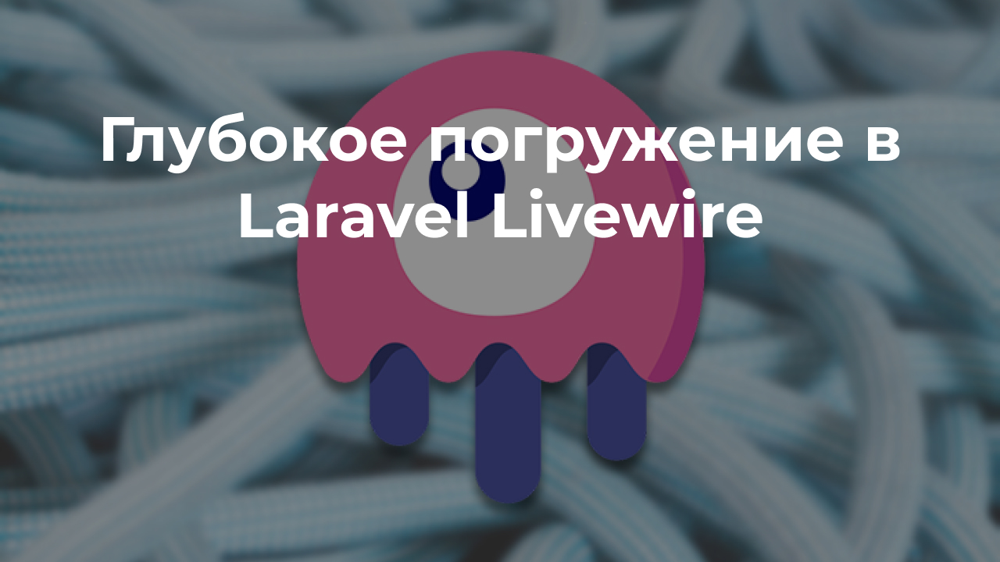
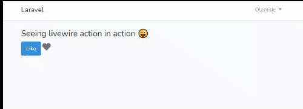
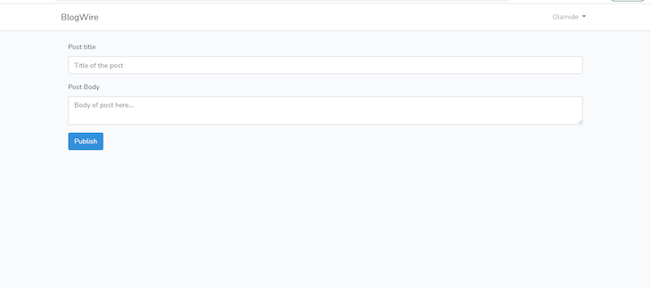

Laravel Livewire - это полнофункциональный фреймворк Laravel для создания динамических интерфейсов. В не столь отдаленном прошлом, чтобы создать приложение с помощью Laravel, вам нужно было либо:

- Писать шаблоны Blade и визуализировать свое приложение на стороне сервера
- Писать API бэкэнд, который принимает и отвечает в формате JSON, а затем используйте фреймворк интерфейса, такой как Vue, React или Angular, для использования API и реализации пользовательского интерфейса

Но теперь у нас есть третий вариант: Livewire. Я бы с удовольствием подробно остановился на плюсах и минусах 1 и 2 вариантов, но это уже было сделано в этом хорошо написанном посте [здесь](https://blog.logrocket.com/livewire-vs-inertia-js/).

В этой статье мы углубимся в Livewire и посмотрим, как его можно применить в реальных приложениях.

## Что мы будем строить

Мы создадим простое приложение для ведения блога со следующими функциями:

- Любой желающий может создать учетную запись и войти в систему
- Зарегистрированные пользователи могут создавать и обновлять свои собственные сообщения
- Любой желающий может читать сообщения

## Предварительные требования и настройка

В этом руководстве предполагается, что у вас достаточно опыта работы с Laravel (обратите внимание, что в этом руководстве используется Laravel 7.x). Никакого предварительного опыта работы с Livewire не требуется — я думаю, именно поэтому мы здесь.

Конечно, для начала мы должны создать нашу среду разработки. Во-первых, создайте новое приложение Laravel:

```shell
composer create-project --prefer-dist laravel/laravel:^7.0 blog-wire
```

Затем установите пакет Livewire с помощью composer:

```shell
composer require livewire/livewire
```

Создайте новую базу данных и добавьте свои учетные данные базы данных в файл `.env`. И это все, что нам нужно, чтобы начать "Livewiring"!

## Как работает Livewire?

Прежде чем мы начнем, полезно иметь представление о том, как Livewire устроен "под капотом". Если простыми словами, то:

- Livewire выводит начальный вывод компонента на страницу — да, как обычный шаблон Blade, отображаемый сервером.
- Когда происходит взаимодействие, Livewire отправляет AJAX-запрос на сервер с обновленными данными
- Сервер повторно отображает компонент и отвечает обновленным HTML-кодом
- Затем Livewire грамотно изменяет DOM в соответствии с тем, что изменилось

Как вы можете видеть, это похоже на то, что ваш интерфейс и бэкэнд находятся в одном месте, без необходимости повторять логику.

## Ключевые понятия в Livewire

### Активация Livewire на странице

Чтобы заставить Livewire работать на странице, вам необходимо включить стили и сценарии Livewire на каждой странице, которая в них нуждается. Обычно они входят в ваш базовый шаблон. Вы бы сделали это с помощью `@livewireStyles` и `@livewireScripts`:

```blade
// app.blade.php
<!DOCTYPE html>
<html lang="en">
<head>
    <meta charset="UTF-8">
    <meta name="viewport" content="width=device-width, initial-scale=1.0">
    <meta http-equiv="X-UA-Compatible" content="ie=edge">
    <title>@yield('title')</title>
    @livewireStyles
</head>
<body>
    @yield('content')
    @livewireScripts
</body>
</html>
```

### Компоненты Livewire

Livewire делает все возможное для своих компонентов. Компоненты Livewire очень похожи на типичные компоненты на основе классов Laravel Blade. Давайте быстро взглянем на два примера ниже.

#### Создание блочного компонента Laravel

Вы могли бы создать компонент Laravel Blade, выполнив следующую команду:

```shell
php artisan make:component Alert
```

Это создаст новый `Alert.php` файл класса и поместите его в папку `App\Views\Components`. Затем создается соответствующий шаблон представления и размещается в разделе `resources/views/components`. Для отображения компонента вы можете использовать следующий синтаксис Blade: `<x-alert/>`.

Вы можете подробнее изучить компоненты Laravel Blade в [документации](https://laravel.com/docs/7.x/blade#components).

#### Создание компонента Livewire

Чтобы создать компонент Livewire, выполните следующую команду:

```shell
php artisan make:component Alert
```

Команда также создаст два новых файла: `app\Http\Livewire\Alert.php` и шаблон представления `resources/views/livewire/alert.php`.

Компонент Livewire можно отобразить с помощью `<livewire:alert />` или `@livewire('alert')`.

Как вы можете видеть, команды выглядят очень похоже. Единственное существенное отличие заключается в том, что с компонентами Livewire существует синхронизация в реальном времени (обновление страницы не требуется) между классом компонента и его шаблоном представления. Вскоре мы увидим, как это работает.

## Свойства Livewire

Общедоступные свойства классов компонентов становятся доступными для представления шаблона компонента. На этом дело не заканчивается — значение свойства синхронизируется в режиме реального времени с представлением, так что при обновлении значения свойства в представлении оно автоматически обновляется в классе компонента.

```php
// App\Http\Livewire\Alert.php
<?php
class Alert extends Component{
  public $message = "Наше любое сообщение";
}

// livewire/alert.blade.php
<div>
  <input wire:model="message">
  <br/>
  
</div>
```

Чтобы привязать свойство компонента к элементу ввода html, вы должны использовать следующий синтаксис:

```
wire:model="property name"
```

Введя в поле ввода, вы увидите значение `$message`, обновляющееся в режиме реального времени. Это очень похоже на концепцию привязки данных в таких фреймворках, как Vue.js , React и Angular. Узнайте больше о свойствах Livewire [здесь](https://laravel-livewire.com/docs/2.x/properties).

## Действия в режиме реального времени

Точно так же, как вы можете привязывать данные в шаблоне представления к общедоступным свойствам компонентов, вы также можете сопоставлять события на стороне клиента с методами в ваших компонентах. Например, вы можете реагировать на события щелчка, события нажатия и нажатия клавиш и т.д., Используя методы, определенные в вашем классе компонентов.

Давайте рассмотрим пример:

```
<?php

use Livewire\Component;
class PostAlert extends Component{
  public $liked = true;
  public function render(){
    return view('livewire.post-alert');
  }

  public function toggleLike(){
    $this->liked = !$this->liked;
  }
}


// livewire/post-alert.blade.php
<div>
    <h4>Наблюдение за действием Livewire в действии ?</h4>
    <button class="btn btn-primary" wire:click="toggleLike">
        Like
    </button>
    @if ($liked)
        <i class="fa fa-heart text-danger h4"></i>
    @else
        <i class="fa fa-heart text-secondary h4"></i>
    @endif
</div>
```

В классе компонентов выше мы создали метод `toggleLike()`, который переключает значение свойства `liked` на противоположное. В представлении шаблона у нас есть кнопка и значок сердца, которые окрашены в красный или серый цвет в зависимости от значения `liked`.

Мы использовали синтаксис `wire:click=[имя действия]`, чтобы привязать метод `toggleLike` к событию щелчка.



Это событие, похожее на переключение действий в режиме реального времени

Многие варианты использования Livewire связаны со свойствами и действиями, и поэтому их очень важно понимать. Эти концепции могут быть применены к таким вещам, как создание формы, редактирование формы, удаление формы и т.д. Подробнее о действиях Livewire читайте [здесь](https://laravel-livewire.com/docs/2.x/actions).

## Валидация данных
Livewire обеспечивает бесперебойную проверку данных. Чтобы проверить данные, поступающие из представления шаблона формы, вы должны написать свойство `$rules`, содержащее ваши правила проверки, как и в Laravel. После этого вы вызываете `$this->validate()` в методе, выполняющем проверку.

Давайте рассмотрим форму для создания записи в блоге:

```
...
class CreatePost extends Component
{
    public $title, $body;
    public $success;
    protected $rules = [
        'title' => 'required|string|max:220',
        'body' => 'required'
    ];

    public function render()
    {
        return view('livewire.create-post')
            ->extends('layouts.app')
            ->section('content');
    }
    public function create(){
        $this->validate();
        Post::create([
            'title' => $this->title,
            'slug' => Str::slug($this->title),
            'body' => $this->body,
            'author_id' => auth()->id()
        ]);

        $this->success = true;
    }
}


// livewire/create-post
<div class="container">
    @if ($success)
        <div class="alert alert-success">
            Post has been created successfully
        </div>
    @endif
    <form wire:submit.prevent="create">
        <div class="form-group">
            <label for="Post title">Post title</label>
            <input wire:model="title" type="text" name="title" id="title" class="form-control" placeholder="Title of the post">
            @error('title') <span class="error"></span> @enderror
        </div>
        <div class="form-group">
            <label for="Post body">Post Body</label>
            <textarea name="body" id="body" placeholder="Body of post here..." wire:model="body" class="form-control"></textarea>
            @error('body') <span class="error"></span> @enderror
        </div>
        <div>
            <button class="btn btn-primary" type="submit">Publish</button>
        </div>
    </form>
</div>
```

В приведенном выше коде формы, когда пользователь отправляет сообщение и оно не проходит проверку, отображаются ошибки проверки, и все это без обновления страницы.

## Начало работы с Laravel Livewire

Достаточно сказано — давайте приступим к делу. Вы можете следить за тем, как мы создаем наше демонстрационное приложение, в [репозитории GitHub](https://github.com/sdkcodes/laravel-livewire-tutorial).

Поскольку мы хотим, чтобы зарегистрированные пользователи могли управлять своими собственными публикациями, они должны сначала создать учетную запись. Для этого мы будем использовать встроенную [систему аутентификации](https://laravel.com/docs/7.x/authentication) Laravel.

Сначала установите пакет `laravel/ui`:

```shell
composer require laravel/ui
```

Затем запустите `php artisan ui vue --auth`, чтобы создать всю систему аутентификации, а затем `php artisan migrate` для миграции вашей базы данных.

Теперь большинство вещей, которые мы привыкли делать с контроллерами, теперь будут выполняться с использованием компонентов Livewire.

Давайте продолжим создавать модель, необходимую для нашего приложения для записей в блоге, `App\Post`:

```php
<?php
namespace App;
use Illuminate\Database\Eloquent\Model;
use Illuminate\Database\Eloquent\SoftDeletes;
class Post extends Model
{
    use SoftDeletes;

    protected $guarded = [];
    public function author(){
        return $this->belongsTo(User::class, 'author_id', 'id');
    }
}
```

Теперь мы создадим наш файл миграции, `php artisan make:migration create_posts_table --table=posts`:

```php
Schema::create('posts', function (Blueprint $table) {
            $table->id();
            $table->string('title');
            $table->string('slug')->unique();
            $table->longText('body');
            $table->integer('author_id');
            $table->timestamps();
            $table->softDeletes();
});
```

## Создание компонентов

Мы будем создавать компонент для каждого действия в блоге, которое мы хотим, т.е. создавать сообщения, редактировать сообщения, перечислять сообщения и просматривать сообщения. Давайте продолжим и создадим компоненты:

- `php artisan make:livewire CreatePost`
- `php artisan make:livewire EditPost`
- `php artisan make:livewire ListPost`
- `php artisan make:livewire HomePost`
- `php artisan make:livewire ReadPost`

Мы можем визуализировать компонент Livewire непосредственно с таких маршрутов, как этот:

```php
Route::get('/posts/create', [\App\Http\Livewire\CreatePost::class, '__invoke'])->middleware('auth');
```

Вместо вызова действий контроллера мы будем выполнять маршрутизацию к компонентам Livewire, как показано выше. Давайте теперь добавим все маршруты, которые нам понадобятся в `web.php`:

```php
Route::get('/', function () {
    return view('index');
});
Auth::routes();
Route::get('/post/{slug}', [\App\Http\Livewire\ReadPost::class, '__invoke']);
Route::get('/home', 'HomeController@index')->name('home');
Route::get('/posts/create', [\App\Http\Livewire\CreatePost::class, '__invoke'])->middleware('auth');
Route::get('/posts/{id}/edit', [\App\Http\Livewire\EditPost::class, '__invoke'])->middleware('auth');
```

Компонент для отображения списка статей будет выглядеть следующим образом:

```
// ListPost.php
<?php
namespace App\Http\Livewire;
use Livewire\Component;
class ListPost extends Component
{
    public function render()
    {
        $posts = \App\Post::latest()->paginate(20);
        return view('livewire.list-post', ['posts' => $posts])
            ->extends('layouts.app')
            ->section('content');
    }
}


// livewire/list-post.blade.php
<div>
    <h4>My Posts <a href="{{ url('posts/create') }}" class="btn btn-primary"><i class="fa fa-plus"></i> Add new</a></h4>
    <ul class="list-group list-group-flush">
        @forelse ($posts as $post)
            <li class="list-group-item">

                <div class="float-right">
                    <a href='{{ url("posts/{$post->id}/edit") }}' class="btn btn-primary"><i class="fa fa-edit"></i> Edit</a>
                </div>
                <div>
                    <h5>{{ $post->title }}</h5>
                    <p>{!! substr(strip_tags($post->body), 0, 200) !!}</p>
                    <small class="text-muted">Published {{ $post->created_at }}</small>
                </div>

            </li>    
        @empty
            <li>Вы еще не написали ни одного поста, напишите один прямо сейчас</li>
        @endforelse

    </ul>
</div>
```

Затем, чтобы создать сообщение, мы будем использовать это:

```php
// CreatePost.php
<?php
namespace App\Http\Livewire;
use App\Post;
use Livewire\Component;
use Illuminate\Support\Str;
class CreatePost extends Component
{
    public $title, $body;
    public $success;
    protected $rules = [
        'title' => 'required|string|max:220',
        'body' => 'required'
    ];

    public function render()
    {
        return view('livewire.create-post')
            ->extends('layouts.app')
            ->section('content');
    }
    public function create(){
        $this->validate();
        Post::create([
            'title' => $this->title,
            'slug' => Str::slug($this->title),
            'body' => $this->body,
            'author_id' => auth()->id()
        ]);

        $this->success = true;
    }
}
```

В вышеупомянутом компоненте мы создаем общедоступные переменные для хранения заголовка и основного содержания записи в блоге, а также переменную `success`, указывающую, успешно ли создано сообщение.

В методе `render()` Livewire позволяет нам указать файл макета, который будет использоваться при рендеринге компонента, и раздел, в котором мы хотим его отобразить, с помощью методов `extends()` и `section()` соответственно.

Теперь представление шаблона выглядит следующим образом:

```blade
<div class="container">
    @if ($success)
        <div>
            <div class="alert alert-success">
                Пост был успешно создан <a href="{{ url('/home') }}">View all posts</a>
            </div>

        </div>
    @endif

    <form wire:submit.prevent="create">
        <div class="form-group">
            <label for="Post title">Заголовок:</label>
            <input wire:model="title" type="text" name="title" id="title" class="form-control" placeholder="Title of the post">
            @error('title') <span class="error">{{ $message }}</span> @enderror
        </div>
        <div class="form-group">
            <label for="Post body">Содержание:</label>
            <textarea name="body" id="body" placeholder="Body of post here..." wire:model="body" class="form-control"></textarea>
            @error('body') <span class="error">{{ $message }}</span> @enderror
        </div>
        <div>
            <button class="btn btn-primary" type="submit">Publish</button>
        </div>
    </form>
</div>
```

Если вы перейдете в своем браузере в раздел `/posts/create`, вы увидите отображаемую форму создания:



Это довольно простой пример того, как Livewire может быть применен в реальном мире.

## Вывод

Livewire устраняет разрыв между бэкендом и интерфейсом. Вы получаете преимущества интерактивности в реальном времени без необходимости самостоятельно писать много JavaScript. Если вы использовали Vue.js раньше было очень легко увидеть преимущества Livewire.

Livewire - не лучший выбор для приложений, которые требуют больших затрат на стороне клиента. Но в ситуациях, когда вам нужно приложение, отрисованное на сервере, с небольшой реактивностью, Livewire сослужит вам хорошую службу.

Опять же, приложение, которое мы создали в этой статье, можно найти на [GitHub](https://github.com/sdkcodes/laravel-livewire-tutorial)

**Эта статья - перевод [оригинальной статьи](https://blog.logrocket.com/deep-dive-into-laravel-livewire/) с блога [LogRocket](https://blog.logrocket.com)**
