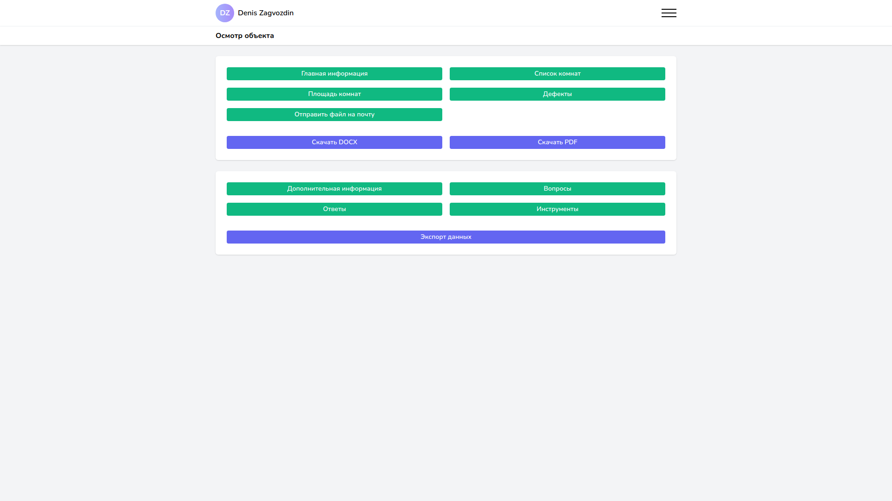

Один из моих последних проектов — ERP сайт, который позволил ускорить работу в 10 раз и позволил сильно упростить жизнь специалистам, работающим в компании.

## Предыстория

Летом 2021 года мы с компанией по приемке квартир договорились о сотрудничестве. С тех пор и по октябрь этого же года мы проделали огромную работу — смогли создать и довести до кондиции сайт для осмотра квартир на дефекты по разным отделкам (черновая, чистовая). Ранее специалисты работали с огромной таблицей в Google документах. Проводить осмотр было неудобно: таблица была слишком большая и на смартфоне было просто-напросто трудно её заполнять. Но на этом работа не заканчивалась — требовалось создать однотипный отчёт о проделанной работе и отправить клиенту, что тоже требовало работы с громоздкой таблицей.

## Что удалось сделать?

Нам удалось по пунктам упорядочить работу и по максимуму исключить человеческий фактор. Теперь всё было постепенно: сначала вводилась общая информация, потом — комнаты, затем — площадь помещений, потом — дефекты. Сайт адаптивен, поэтому удобно работать как с компьютера, так и с телефона. Помимо всего этого отчёт об осмотре объекта формируется автоматически и в удобном формате (PDF или DOCX). Тем самым работа существенно ускорилась.

## Вместо заключения

Я предлагаю свои услуги по автоматизации работы в компании. Возможно, вы и не подозреваете, как сильно можно облегчить и упростить какие-то процессы в вашем бизнесе. Как в примере выше, может, вы тоже пользуетесь таблицами: это вроде бы удобно и позволяет решать поставленные задачи, но можно сделать ещё лучше!

Предела совершенству нет. Уверен, после автоматизации одного процесса, вы захотите продолжить сотрудничество и развивать ERP систему дальше :)
