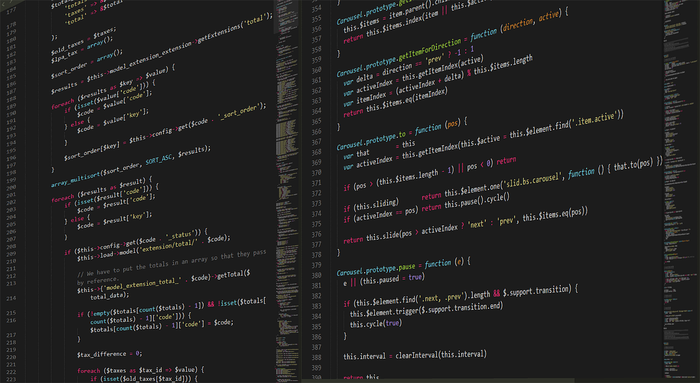

## Вступление

Почти каждый человек в 21 веке пользовался сайтами. Сайты - это уже неотъемлемая часть нашей жизни, то, из чего, по сути, состоит вся мировая паутина. Каждый бизнес стремится создать свой сайт, каждый самозанятый предприниматель хочет, чтобы у него был сайт-визитка или лендинг, ведь мы все так привыкли пользоваться интернетом.

## Так ли сложно в 21 веке научиться создавать сайты?

Давайте разберёмся с этим вопросом. Научиться писать сайты сейчас может любой желающий человек - материалов, уроков, гайдов, курсов в интернете очень много, причём как платных, так и бесплатных. Но на это всё нужен очень ценный ресурс - время. Не у всех оно есть. С другой стороны, писать сайты самому сейчас необязательно: есть очень много конструкторов сайтов, в которых уже заготовлены шаблоны для разных бизнесов, есть CMS-движки, которые при минимальных знаниях программирования позволяют создавать сложные сайты. Но конструкторы имеют несколько недостатков перед ручным написанием сайта:

- конструкторы/движки добавляют лишний код из-за чего сайт замедляется
- невозможно построить сложную архитектуру (подходит только для небольших проектов)

Прямо противоположные особенности имеет ручное написание кода:

- код пишет программист, лишнего ничего нет, скорость загрузки увеличивается
- возможно писать сложные и большие проекты

## А теперь покажу видео, как я создавал этот сайт

<iframe width="100%" height="400" src="https://www.youtube.com/embed/mnNTIXDIJRs\" title="YouTube video player" frameborder="0" allow="accelerometer; autoplay; clipboard-write; encrypted-media; gyroscope; picture-in-picture" allowfullscreen></iframe>
